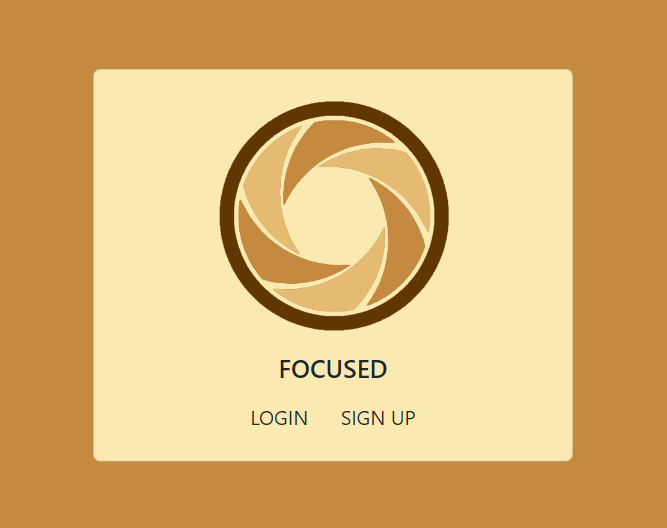
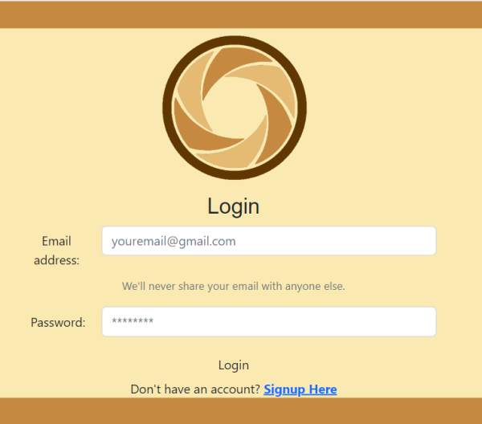
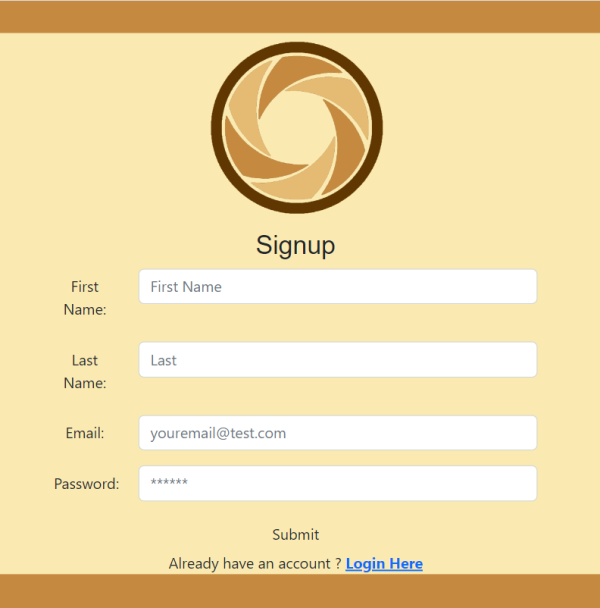
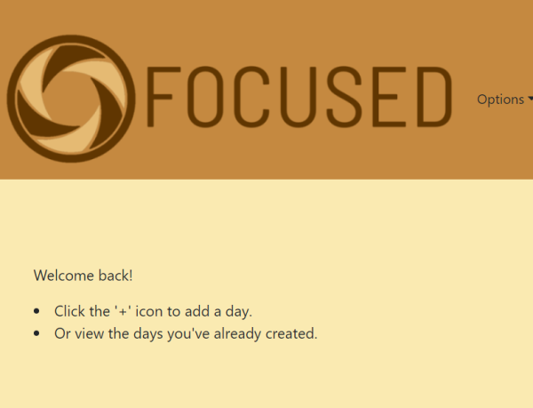
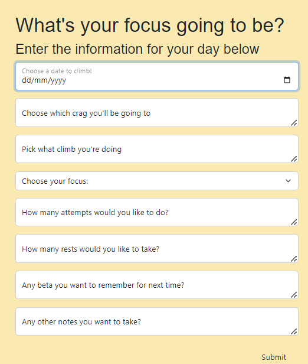
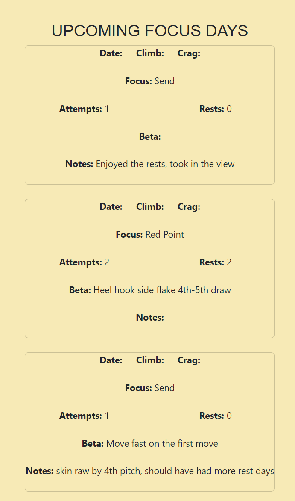

# focused-app

# FOCUSED

---

## Description

Focused is a climbing app for planning your outdoor days. Climbers sometimes feel left in the past with many of us still relying on pen to paper to take notes about our sessions; whether that be indoors or outdoors. Focused was created so that prior to heading outside next you can input a day, pick the climb and decided what your focus is gojng to be for it. The user can then retrospectively edit their day with notes about the climb for when they come back to it. 

Focused allows the user to see their days coming up and be able to plan accordignly so they can spend more time on the wall!

I overcame quite a lot of hurdles with React as this was my first application where I used it for my front end. Deploying a client and server side project to Heroku also allowed me to de-bug and learn some helpful tricks for next time. In addition learning the differences between React-Bootstrap and general Bootstrap was a good learning curve. I also became a bit more efficient at reading and understanding docs. I'm also pretty proud of how I was able to debug and implement fixes on my own as it involved what felt like a maze of understanding console errors.

Focused is still very much a work in progress with lots of ideas to implement for future development so keep checking back!

---

## Table of Contents

- [Installation](#installation)
- [Usage](#usage)
- [Bugs to Resolve](#bugs-to-resolve)
- [Future Development](#future-development)
- [License](#license)
- [Credits](#credits)

---

## Installation

The user will need to clone the application from my GitHub account: https://github.com/RosemaryJF/focused-app, to their local repository, and install Node.js, MongoDB, express and npm on their code editor, if it isn't already.

Once cloned to the local repository the user will need to run `npm i` or `npm install` so that the necessary packages are installed on the application, in the correct levels.

Next the user should open focused in their integrated terminal. They should run the following command:

- `npm run seed`

They will seed the database in the server folder. Once this has been done they can choose to test queries on Apollo by running:

- `npm start`

The terminal will present the user with a link to follow. 

To run the program in development mode if they want to make code level changes that are reflected live the user should run the following in their terminal:

- `npm run develop`

This ensures the program will load changes in real time each time the user saves.

---

## Usage

To use the application the user can navigate to the seeded Heruko deployment link here:  https://stark-taiga-90419.herokuapp.com/

From the homepage they will be asked to login or signup:

To get to the dashboard they will be prompted to log in:

If they are new they can head to the sign up to create an account:

Once the user is logged in they can now navigate to the below options from their profile page:

- `+` (adding a day)
- Days (viewing their days)
- Logout

Adding a new day presents a form like this:

They can also preview all their upcoming days:

If the users session expires they will be logged out and redirected back to the homepage.

---

## Bugs to Resolve

- Climbs not being fetched correctly in Days
- Crags not being fetched correctly in Days
- Dropdown menu option not easy to use and double collapses when on small screen size
- Day date not generating or being fetched properly
- App currently functioning best as mobile first (as intended), but gets buggy when wider, need to resolve

---

## Future Development

- Make it a nice user experience overall
- Quash all current bugs FOCUSED has
- API calls to thecrag.com to fetch crags, climbs and topos (essentially maps of a route) data the user can choose from for their days
- Have this all stored inside their days for actual day reference (this means no more guidebooks and lighter loads to carry!)
- Have FOCUSED functioning offline as a downloadable app, so it can be used/relied on a day when the user is in a remote location with no coverage
- API calls to a weather app so the user can also choose a crag/climb that will be suitable for their day depending on the forecast

---

## License

This application is licensed under a [GNU GPL v3](https://github.com/RosemaryJF/focused-app/blob/main/LICENSE).

---

## Credits

- https://www.advnture.com/features/rock-climbing-terms
- https://github.com/nodejs/node-gyp#on-windows
- https://www.apollographql.com/docs/apollo-server/v3/data/resolvers
- https://www.apollographql.com/docs/apollo-server/v3/schema/schema#the-query-type
- https://graphql.org/learn/queries/
- https://medium.com/@ralph1786/adding-and-removing-items-from-redux-store-6d1303ed32c6
- https://www.123rf.com/photo_110312469_set-of-aperture-icons-vector-illustration-focus-icon-camera-icon-isolated.html
- https://github.com/facebook/create-react-app/issues/11880 [IFRAME ISSUE]
- https://react-bootstrap.github.io/

There are many more as well, but alas that would mean copy and pasting my entire browser history from the last 3 days :')